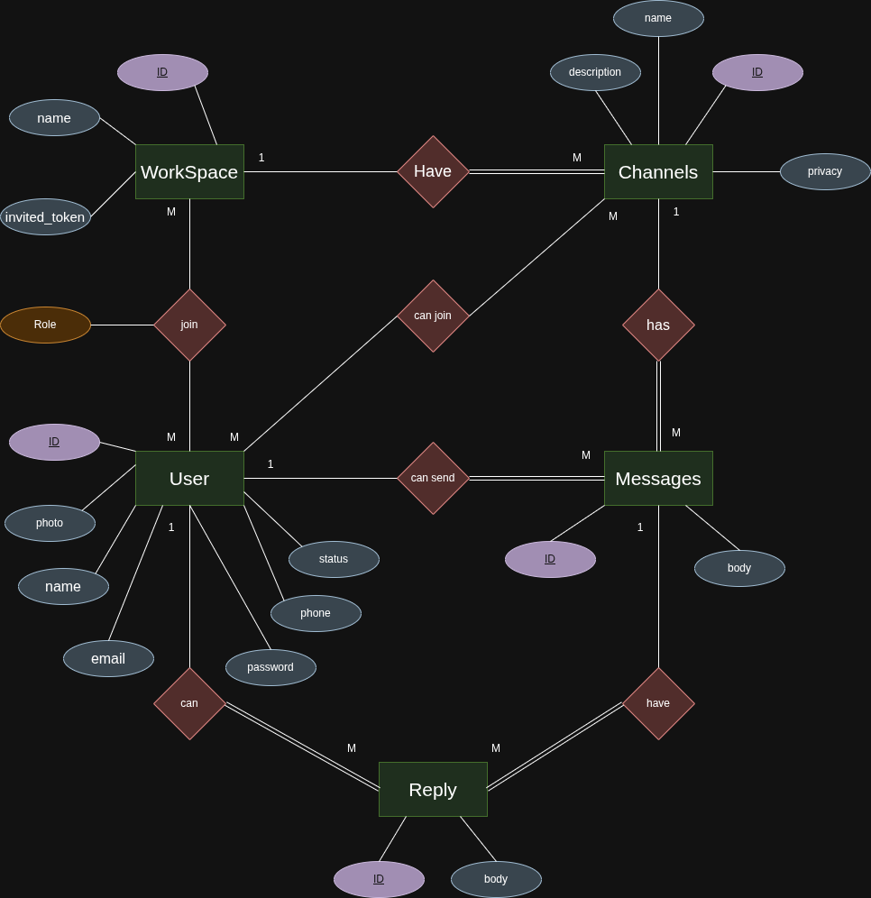

# Solva – Team Chat & Workspaces (Slack Clone)

Solva is a team communication app inspired by Slack, built with Ruby on Rails.
It allows users to create workspaces, organize conversations into channels, send messages, and reply to messages in threaded form.

### 🚀 Getting Started (Run the project locally)
1. Clone the repository

```bash
   git clone https://github.com/your-username/solva.git
   cd solva
```

2. Install dependencies
   * Make sure you have:
        1. Ruby (appropriate version for your Rails)
        2. Rails
        3. PostgreSQL or SQLite (depending on what you picked)
        4. Node & yarn (for JS / CSS bundling if needed)

Then:
```ruby 
bundle install
```
3. Setup the Database
```ruby
rails db:create
rails db:migrate
```
4. Start the server
```ruby
rails server
```
5. Open your browser and navigate to http://localhost:3000 to access Solva

## ERD (Entity Relationship Diagram):


## MAPPING:
[//]: # (for mapping)
wait for it ....

### Key Features:

#### 1. Workspace Authentication & Workspaces
1. Users can sign up, log in, and manage their profile.
2. Users can create new workspaces.
3. Workspace creator becomes the owner.
4. Users can join workspaces via invite token/link.
5. Roles per workspace via Membership:
   - owner
   - admin
   - member

#### 2. Channels
1. Workspaces contain multiple channels.
2. Channels have:
    - name
    - description
    - privacy (public / private)
3. Public channels: Is On for ALL USERS in this Workspace.
4. Private channels: If User is an ADMIN or The OWNER Can See this Private channels.

#### 3. Messages
1. Users can send messages within channels
2. Each message:
    - belongs to one user
    - belongs to one channel
    - has content
    - supports timestamps
    - can be threaded

#### 4. Replies (Threaded Messages)
1. Messages can have multiple replies (threads)
2. Each reply:
    - belongs to one message
    - belongs to one user
    - appears in a thread view
    - maintains chronological order
3. Threading helps organize conversations and reduce channel clutter

### 🛠 Technologies Used
1. Ruby on Rails – backend & MVC
2. Devise – user authentication
3. Tailwind CSS – styling
4. SQLite – database
5. RSpec – testing

## How Solva Works (Workflow)

This section explains how the Solva Slack-like app works from a user perspective and how the main features are
connected.

### 1. User Registration & Login

A visitor creates an account using the Sign up page (Devise).

After registration or login, the user is redirected to their Workspaces page.

From here, the user can:

- Create a new workspace
- Join an existing workspace using an invite link (planned flow)
- Open any workspace they are already a member of

### 2. Workspaces & Memberships

#### Creating a Workspace

From the Workspaces index page, the user clicks "New Workspace".

The user fills in the workspace name and submits the form.

When a workspace is created:

- A Workspace record is created
- A Membership record is automatically created for the current user with:
    - user_id = current user
    - workspace_id = the new workspace
    - role = owner
- An invite_token is generated for this workspace (e.g. with before_create in the model)

The user is redirected to the workspace show page, where they can:

- See workspace details
- See the list of channels inside this workspace
- Create new channels
- Copy the invite link to share with others

#### Membership Roles

Each workspace has memberships that connect users to it:

**owner:**

- The user who created the workspace
- Can update and delete the workspace
- Can create public and private channels

**admin:**

- Similar to owner for channel management (depending on your rules)
- Can create public and private channels

**member:**

- Normal user inside the workspace
- Can see all public channels
- Can only create public channels (cannot create private channels)
- Cannot update or delete the workspace

Roles are stored in the memberships table using an enum field role (owner, admin, member).

### 3. Invite Links & Joining Workspaces

Each workspace has an automatically generated invite_token.

**Example invite URL format:**
```link
http://localhost:3000/workspaces/:invite_token
```

**Planned flow:**

1. The owner/admin copies the invite link from the workspace page.
2. They send it to a friend.
3. The friend:
   -  Logs in (or signs up). 
   - Opens the invite link.
4. The app:
   - Finds the workspace by invite_token.
   - Creates a new Membership record for this user with role member.
   - Redirects the user to the workspace page.

**Right now, the first step is just displaying the invite link and making it easy to copy. The actual “join via link” flow can be implemented later.**  

### 4. Channels Inside a Workspace

**Each workspace has multiple channels.**
    - A Channel belongs to a Workspace.
    - Fields include: name, description, privacy, workspace_id.
    - privacy is an enum with: public, private.

**Creating Channels**
1. From the workspace page or channels index, the user clicks "New Channel".
2. The user fills in:
   - Channel name 
   - Description 
   - Privacy (public or private)

**Authorization rules:**

* If the channel is private:
    - Only owner or admin can create it.
* If the user is a member and tries to create a private channel:
    - The app redirects back with an error message:

"Only admins and owners can create private channels."

**Viewing Channels**

In the workspace page and in the channels index, the list of channels is filtered based on the user’s role:

* If user is owner or admin:
    - They see all channels (public + private).
* If user is member:
    - They only see public channels.

Additionally, there's an authorization check on **ChannelsController#show**: Members cannot access a private channel even by typing the URL manually.  If they try, they are redirected back with an alert message.

### 5. Messages & Replies

Inside each channel:
**A Message:**
* belongs to a Channel
* belongs to a User

A user can send multiple messages in a channel. Messages are loaded and displayed in the channel show page (chat area).

**Replies:**
* belongs to a Message
* belongs to a User

A message can have many replies (thread-like behavior).
This allows threaded conversations per message (similar to Slack threads).
Real-time messaging using ActionCable/WebSockets can be added later to turn this into a true live chat experience.

### 6. Authorization Summary

#### Workspace Level

**Owner Permissions:**

- Update workspace details
- Delete workspace
- Create and manage channels (public/private)
- Invite new members
- Manage member roles

**Admin Permissions:**

- Create and manage channels (public/private)
- Invite new members
- View all channels

**Member Permissions:**

- View workspace
- View public channels
- Create public channels
- Send messages in accessible channels
- Participate in threads

#### Channel Level

**Owner/Admin:**

- Create public and private channels
- Update channel settings
- Delete channels
- View all channels
- Pin messages
- Manage channel members

**Member:**

- View public channels only
- Create public channels
- Cannot create private channels
- Cannot modify channel settings

#### Planned Features

**Channel Membership:**

- Dedicated ChannelMemberships table
- Individual channel roles and permissions
- Channel-specific moderators
- Custom invite management per channel

**Enhanced Permissions:**

- Granular message management
- Thread moderation controls
- Channel-specific posting restrictions
- Custom role definitions


### 📆 Project Plan (Sprints / Milestones)

#### Sprint 1 – Setup & Authentication

**Goal**: Set up project foundation and implement authentication.

**Tasks**:

- Initialize Rails project with Tailwind:
  ```ruby
  rails new solva --css tailwind
  ```
- Configure Devise and generate User model
- Add extra fields to User:
    - name
    - phone
    - status
- Create basic navigation & layout (sign in / sign up / sign out)
- Set up root page after login ("Your Workspaces")

**Deliverables**:

- Fully working authentication
- Styled auth forms (Tailwind)
- Basic layout

#### Sprint 2 – Workspaces & Memberships

**Goal**: Implement workspace management and user membership.

**Tasks**:

- Generate Workspace model:
    - name
    - invited_token
- Generate Membership model:
    - user:references
    - workspace:references
    - role:integer (enum: owner/admin/member)
- Add associations:
  ```ruby
  User has_many :memberships, :workspaces, through: :memberships
  Workspace has_many :memberships, :users, through: :memberships
  ```
- Implement:
    - Create workspace
    - List user workspaces
    - Show workspace page
    - Generate invited_token for each workspace
    - "Join workspace via invite link"

**Deliverables**:

- User can create & join workspaces
- Roles stored via enum integer (0/1/2)

#### Sprint 3 – Channels

**Goal**: Organize conversations within workspace channels.

**Tasks**:

- Generate Channel model:
    - name
    - description
    - privacy
    - workspace:references
- Add associations:
  ```ruby
  Workspace has_many :channels
  Channel belongs_to :workspace
  ```
- Implement:
    - Create/list/show channels within workspace
    - Apply basic rules:
        - Public channels → accessible to all workspace members
        - Private channels → restricted (owner/admin only)

**Deliverables**:

- Channel management per workspace
- Channel UI within workspaces

#### Sprint 4 – Messages & Replies

**Goal**: Add real-time chat functionality with threaded replies.

**Tasks**:

- Generate Message model:
    - body
    - user:references
    - channel:references
- Generate Reply model:
    - body
    - message:references
    - user:references
- Add associations:
  ```ruby
  Channel has_many :messages
  Message belongs_to :channel, :user
  Message has_many :replies
  Reply belongs_to :message, :user
  ```
- Implement UI:
    - Show messages in channel
    - New message form
    - Show threaded replies
    - Reply form

**Deliverables**:

- Working channel chat
- Threaded message replies

#### Sprint 5 – Roles, Permissions & Polish

**Goal**: Refine authorization and improve UX.

**Tasks**:

- Use Membership.role to control:
    - Channel creation permissions
    - Private channel access
- Add basic authorization (custom methods or Pundit later)
- Add flash messages, error handling, validations
- Improve styling with Tailwind
- Add basic tests (models & important controllers)
- Update README with final notes + screenshots

**Deliverables**:

- Stable, usable Slack-like MVP
- Documented roles & permissions
- Cleaner UI


#### Sprint 6 – Channel Join & Message Display

**Goal**: Users should properly join channels and view message history.

**Tasks**:

- Implement joining channels through workspace membership
- Add channel membership checks before showing messages 
- Load messages for a channel in chronological order
- Add UI to show the selected channel and messages area
- Prevent access to private channels without permission

**Deliverables**:

- Members can enter channels
- Messages displayed per channel
- Access control for public/private channels

#### Sprint 7 – Chat Styling & Scrollable UI

**Goal**: Improve the chat UX with a modern look.

**Tasks**:

- Tailwind styling for chat layout
- Channel sidebar + chat main window structure
- Make message list scrollable
- Sticky footer form for message input
- Improve message bubbles & timestamps

**Deliverables**:

- Clean Slack-like UI
- Scrollable conversation area
- Professional chat layout

#### Sprint 8 – Testing (RSpec) + Bug Fixing

**Goal**: Add essential test coverage + clean code.

**Tasks**:

- Model specs for:
- Workspace
- Membership
- Channel
- Message
- Reply
- Controller basic spec methods
- Fix channel permissions issues
- Handle missing users / missing messages bugs
- Add validation tests

**Deliverables**:

- RSpec test suite up and running
- Improved stability
- Fixed edge cases
- Cleaner code structure

#### Sprint 9 – Follow SOLID and Design Patterns code

**Goal**: Refactor my controllers + Learn Service + Learn Queries

**Tasks & Deliverables**:

- create services for (channel - membership - workspace)
- create Queries for (channel - message - workspace)
- create concerns files for manage controller
